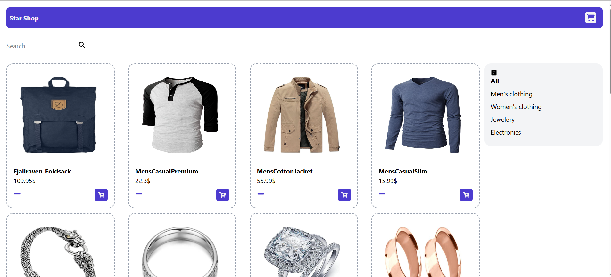

# ShopStart with React.js

**A modern, responsive storefront built with React, Vite & TailwindCSS.**

<p align="center">
  
</p>

---

## Features

- **Lightning-fast dev & build** via Vite
- **Component-based UI** powered by React
- **State Management** with Redux Toolkit for predictable state updates
- **Shopping Cart** with add, remove, and quantity management
- **Product Browsing** with detailed product pages and search functionality
- **Utility-first styling** with TailwindCSS
- **Client-side routing** using React Router
- **HTTP requests** handled by Axios with Redux async thunks
- **Responsive design** optimized for all devices
- **Accessible & responsive** out of the box
- **Linting** powered by ESLint (React & Hooks plugins)

---

## Tech Stack

| Dependency                                                | Purpose                                    |
| --------------------------------------------------------- | ------------------------------------------ |
| [React](https://reactjs.org/)                             | UI library                                 |
| [Redux Toolkit](https://redux-toolkit.js.org/)            | State management with less boilerplate     |
| [React Redux](https://react-redux.js.org/)                | React bindings for Redux                   |
| [Vite](https://vitejs.dev/)                               | Next-gen dev server & bundler              |
| [TailwindCSS](https://tailwindcss.com/)                   | Utility-first CSS framework                |
| [React Router](https://reactrouter.com/)                  | Client-side routing                        |
| [React Icons](https://react-icons.github.io/react-icons/) | Popular icon libraries as React components |
| [Axios](https://axios-http.com/)                          | HTTP requests                              |
| ESLint & Plugins                                          | Code quality & consistency                 |

---

## Getting Started

1. **Clone** this repository

   ```bash
   git clone https://github.com/sajjadnazaridev/Shop-start-with-React.js.git
   cd Shop-start-with-React.js
   ```

2. **Install** dependencies

   ```bash
   npm install
   # or
   yarn
   ```

3. **Run** in development mode

   ```bash
   npm run dev
   # or
   yarn dev
   ```

   > The app runs at `http://localhost:5173` by default.

4. **Build** for production

   ```bash
   npm run build
   # or
   yarn build
   ```

5. **Preview** your build locally
   ```bash
   npm run preview
   # or
   yarn preview
   ```

---

## Redux State Management

This application uses **Redux Toolkit** for efficient state management:

### Cart Management

- Add products to cart
- Increase/decrease product quantities
- Remove products from cart
- Calculate total prices and item counts
- Checkout functionality

### Product Management

- Fetch products from API
- Handle loading states
- Error handling for API requests
- Product search and filtering

### Key Redux Features

- **Redux Toolkit** for reduced boilerplate
- **Async Thunks** for API calls
- **Immutable Updates** with Immer
- **DevTools Integration** for debugging

---

## Project Structure

```
src/
├── app/
│   └── store.js              # Redux store configuration
├── components/
│   ├── CardProduct.jsx       # Product card component
│   ├── layout/               # Layout components
│   ├── Templates/            # Page templates
│   └── ui/                   # Reusable UI components
├── features/
│   ├── cart/
│   │   └── cartSlice.js      # Shopping cart Redux slice
│   └── product/
│       └── productSlice.js   # Products Redux slice
├── pages/
│   ├── ProductPage.jsx       # Products listing page
│   ├── DetailsPage.jsx       # Product details page
│   └── CheckoutPage.jsx      # Shopping cart checkout
├── helpers/
│   └── helper.js             # Utility functions
└── services/
    └── config.js             # API configuration
```

---

## ESLint & Formatting

- **Lint** your code:
  ```bash
  npm run lint
  # or
  yarn lint
  ```
- Feel free to integrate **Prettier** or your editor’s format-on-save for consistent style.

---

## Contributing

1. Fork this repo
2. Create a feature branch (`git checkout -b feature/YourFeature`)
3. Commit your changes (`git commit -m "feat: add awesome feature"`)
4. Push to branch (`git push origin feature/YourFeature`)
5. Open a Pull Request

---

## Acknowledgments

- [Vite](https://vitejs.dev/) for blazing-fast builds
- [Tailwind Labs](https://tailwindcss.com/) for an amazing CSS framework
- The React community for endless inspiration

---

> _Built with ❤️ by [Seyed Sajjad Nazari](https://sajjad-nazari.netlify.app)_
