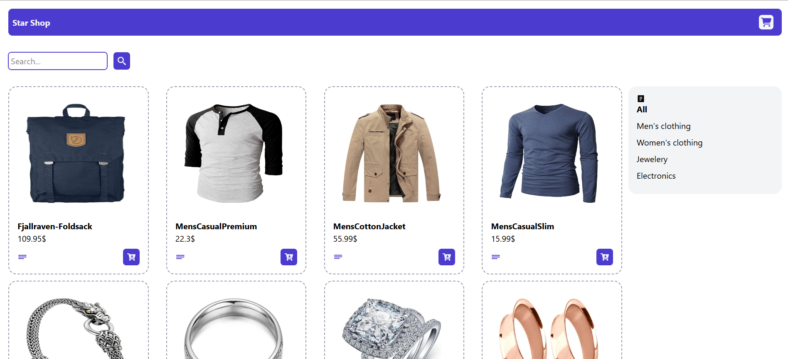

# ShopStart with React.js

**A modern, responsive storefront built with React, Vite & TailwindCSS.**

<p align="center">
  
</p>

---

## Features

- **Lightning-fast dev & build** via Vite  
- **Component-based UI** powered by React  
- **Utility-first styling** with TailwindCSS  
- **Client-side routing** using React Router  
- **HTTP requests** handled by Axios  
- **Accessible & responsive** out of the box  
- **Linting** powered by ESLint (React & Hooks plugins)

---

## Tech Stack

| Dependency                | Purpose                            |
| ------------------------- | ---------------------------------- |
| [React](https://reactjs.org/)            | UI library                         |
| [Vite](https://vitejs.dev/)             | Next-gen dev server & bundler      |
| [TailwindCSS](https://tailwindcss.com/)  | Utility-first CSS framework        |
| [React Router](https://reactrouter.com/) | Client-side routing                |
| [Axios](https://axios-http.com/)         | HTTP requests                      |
| ESLint & Plugins          | Code quality & consistency         |

---

## Getting Started

1. **Clone** this repository  
   ```bash
   git clone https://github.com/sajjadnazaridev/Shop-start-with-React.js.git
   cd Shop-start-with-React.js
   ```

2. **Install** dependencies  
   ```bash
   npm install
   # or
   yarn
   ```

3. **Run** in development mode  
   ```bash
   npm run dev
   # or
   yarn dev
   ```
   > The app runs at `http://localhost:5173` by default.

4. **Build** for production  
   ```bash
   npm run build
   # or
   yarn build
   ```

5. **Preview** your build locally  
   ```bash
   npm run preview
   # or
   yarn preview
   ```

---

## ESLint & Formatting

- **Lint** your code:  
  ```bash
  npm run lint
  # or
  yarn lint
  ```
- Feel free to integrate **Prettier** or your editor’s format-on-save for consistent style.

---

## Contributing

1. Fork this repo  
2. Create a feature branch (`git checkout -b feature/YourFeature`)  
3. Commit your changes (`git commit -m "feat: add awesome feature"`)  
4. Push to branch (`git push origin feature/YourFeature`)  
5. Open a Pull Request

---

## Acknowledgments

- [Vite](https://vitejs.dev/) for blazing-fast builds  
- [Tailwind Labs](https://tailwindcss.com/) for an amazing CSS framework  
- The React community for endless inspiration  

---

> _Built with ❤️ by [Seyed Sajjad Nazari](https://sajjad-nazari.netlify.app)_